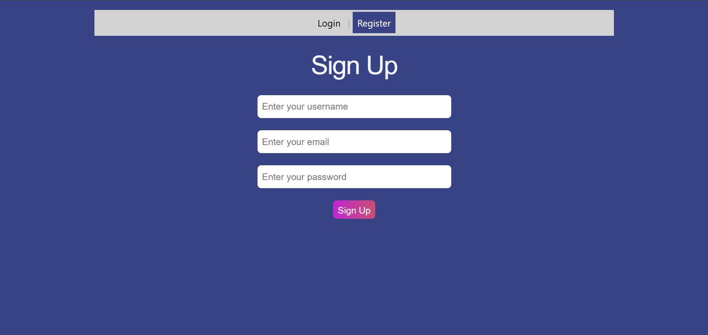
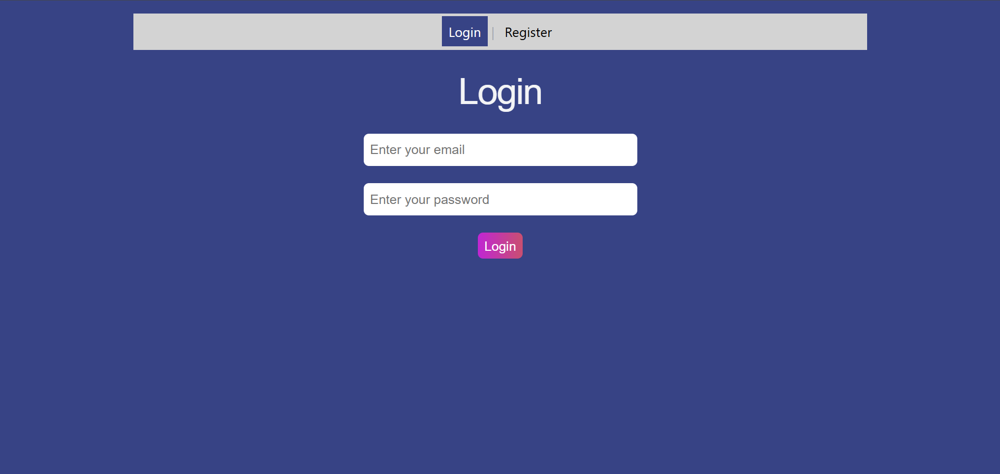
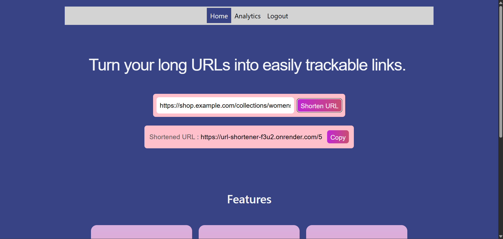
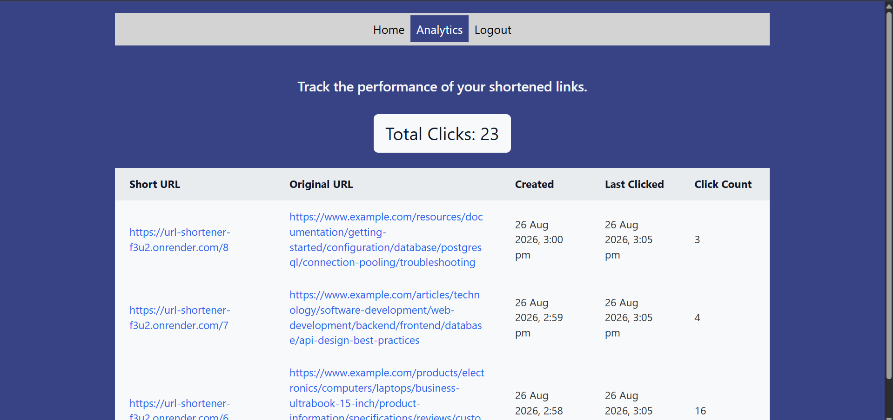
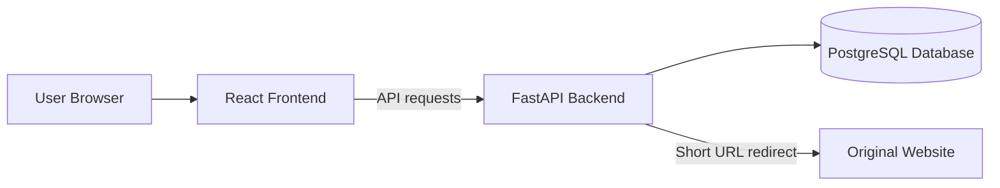
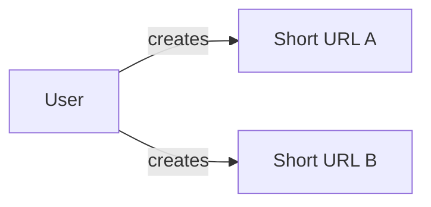

# URL Shortener

A full-stack URL Shortener built using React, FastAPI, and PostgreSQL

## Link
[Try the URL Shortener](https://url-shortener-mayuri9.vercel.app/login)
> Note: The backend is hosted on Render and may take upto a minute
> to wake up after a period of inactivity.

## Demo

### 1. Authentication

### 2. Create a short URL

### 3. View analytics

## Architecture Diagram

## Tech Stack

**Frontend:** React, React Router, JavaScript, CSS

**Backend:** Python, FastAPI

**Database:** PostgreSQL

**Authentication:** bcrypt, JWT

**Testing**: pytest, Vitest

**CI/CD:** GitHub Actions

**Deployment:** Vercel (frontend), Render (backend), Neon (PostgreSQL)

## Features
- User registration and login
- User specific URL ownership and authorization
- JWT-based authentication
- Generate unique short URLs using Base62-encoded auto-increment IDs
- Store URL mappings in PostgreSQL
- Redirect using FastAPI `RedirectResponse`
- View URL analytics

## API Endpoints

| Method | Endpoint | Authentication | Description |
|---|---|---|---|
| `POST` | `/register` | No | Register a new user |
| `POST` | `/login` | No | Authenticate a user |
| `POST` | `/shorten` | Yes | Create a shortened URL |
| `GET` | `/{code}` | No | Redirect to the original URL |
| `GET` | `/stats/{code}` | Yes | Retrieve analytics for a shortened URL |
| `GET` | `/auth` | Yes | Check is user logged in or not |
| `GET` | `/stats`| Yes | Retrieve all analytics for a given user ID |

## Database Schema

The application uses PostgreSQL with 2 tables:

> Each user can own multiple shortened URLs, while each shortened URL belongs to a single user

### `Users`

| Column | Type | Constraints|Description |
|---|---|---|---|
| `user_id` |INTEGER|PRIMARY KEY| Unique identifier for the user, PRIMARY KEY |
| `email` |TEXT|UNIQUE| User's email address|
| `user_name` |TEXT|1-30 characters| User's username |
| `password_hash` |TEXT|| Bcrypt hash of the user's password |

### `Urls`

| Column |Type|Constraints| Description |
|---|---|---|---|
| `url_id` |INTEGER|PRIMARY KEY| Unique identifier for the shortened URL |
| `code` |TEXT|UNIQUE| Base62-encoded short URL code |
| `long_url`|TEXT| | Original URL |
| `click_count` |INTEGER| | Number of times the shortened URL was clicked |
| `created_at`|TIMESTAMPTZ| | Timestamp when the shortened URL was created |
| `last_clicked_at`|TIMESTAMPTZ| | Timestamp of the most recent click |
| `user_id` |INTEGER|FOREIGN KEY| ID of the user who owns the URL |

> `urls.user_id` is a foreign key referencing `users.user_id`.
