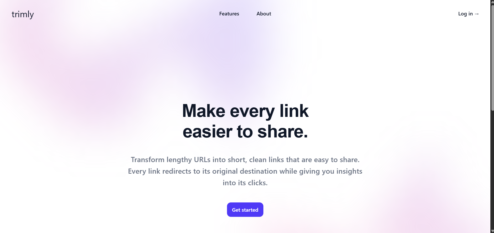
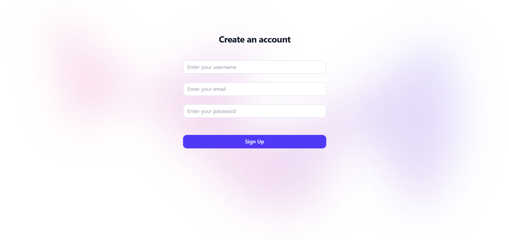
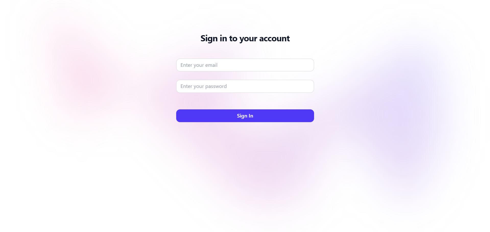
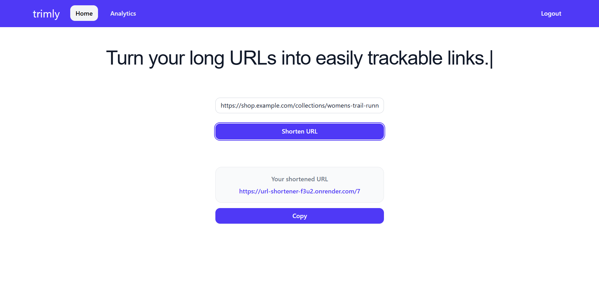
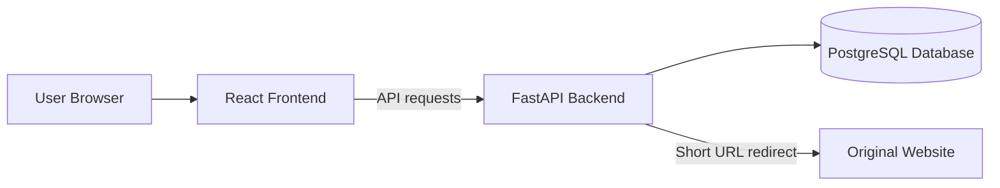
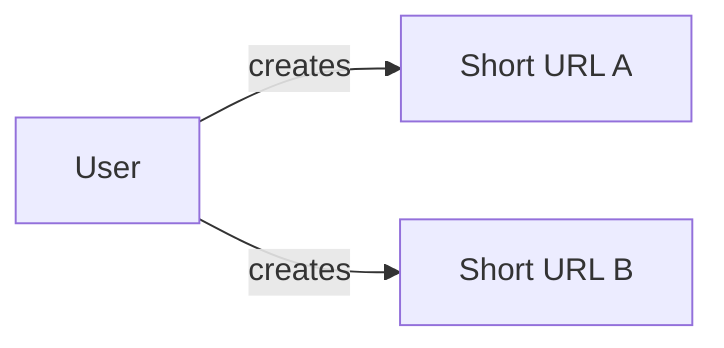

# URL Shortener

A full-stack URL Shortener built using React, FastAPI, and PostgreSQL for creating, redirecting and tracking short links.

## Link
[Try the URL Shortener](https://gettrimly.vercel.app/)
> Note: The backend is hosted on Render and may take upto a minute
> to wake up after a period of inactivity.

## Demo

### 1. Landing Page

### 2. Authentication

### 3. Create a short URL

### 4. View analytics

## Architecture Diagram

## Tech Stack

- **Frontend:** React, React Router, JavaScript, Tailwind CSS

- **Backend:** Python, FastAPI

- **Database:** PostgreSQL

- **Authentication:** bcrypt, JWT

- **Testing**: pytest, Vitest

- **CI/CD:** GitHub Actions

- **Deployment:** Vercel (frontend), Render (backend), Neon (PostgreSQL)

## Features
- User registration and login.
- JWT-based authentication.
- Generate unique short URLs using Base62-encoded auto-increment IDs.
- View URL analytics, including total clicks and last clicked time.
- Track URL performance with daily click analytics for the last 7 days.

## API Endpoints

| Method | Endpoint | Authentication | Description |
|---|---|---|---|
| `POST` | `/register` | No | Register a new user |
| `POST` | `/login` | No | Authenticate a user |
| `POST` | `/shorten` | Yes | Create a shortened URL |
| `GET` | `/{code}` | No | Redirect to the original URL |
| `GET` | `/stats/{code}` | Yes | Retrieve analytics for a shortened URL |
| `GET` | `/auth` | Yes | Check is user logged in or not |
| `GET` | `/stats`| Yes | Retrieve all analytics for a given user ID |
| `GET` | `/clicks/daily` | Yes | Retrieve daily click count across all URLs for past 7 days (~168 hours)

## Database Schema

The application uses PostgreSQL with 3 tables:

> Each user can own multiple shortened URLs, while each shortened URL belongs to a single user

### `users`

| Column | Type | Constraints|Description |
|---|---|---|---|
| `user_id` |INTEGER|PRIMARY KEY| Unique identifier for the user, PRIMARY KEY |
| `email` |TEXT|UNIQUE| User's email address|
| `user_name` |TEXT|1-30 characters| User's username |
| `password_hash` |TEXT|NOT NULL| Bcrypt hash of the user's password |

### `urls`

| Column |Type|Constraints| Description |
|---|---|---|---|
| `url_id` |INTEGER|PRIMARY KEY| Unique identifier for the shortened URL |
| `code` |TEXT|UNIQUE| Base62-encoded short URL code |
| `long_url`|TEXT| NOT NULL| Original URL |
| `click_count` |INTEGER| NOT NULL DEFAULT 0| Number of times the shortened URL was clicked |
| `created_at`|TIMESTAMPTZ|NOT NULL DEFAULT NOW() | Timestamp when the shortened URL was created |
| `last_clicked_at`|TIMESTAMPTZ| | Timestamp of the most recent click |
| `user_id` |INTEGER|FOREIGN KEY| ID of the user who owns the URL |

> `urls.user_id` is a foreign key referencing `users.user_id`.

### `click_events`

| Column |Type|Constraints| Description |
|---|---|---|---|
| `click_id` |INTEGER|PRIMARY KEY| Unique identifier for the click event |
| `click_time` |TIMESTAMPTZ|NOT NULL| Click timestamp |
| `url_id`|INTEGER| FOREIGN KEY| ID of the url |

> `click_events.url_id` is a foreign key referencing `urls.url_id`.