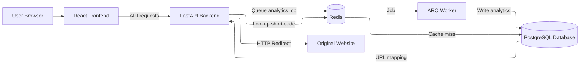
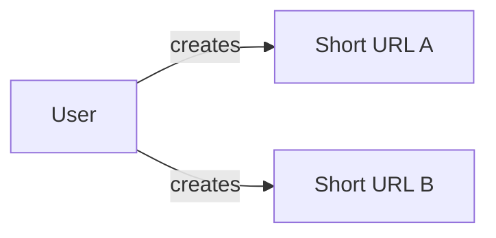
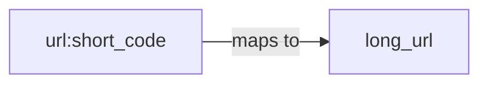

# URL Shortener

A full-stack URL Shortener built using React, FastAPI, PostgreSQL, Redis, and ARQ for creating, redirecting, and tracking short links.

## Link
[Try the URL Shortener](https://gettrimly.vercel.app/)

## Demo

### 1. Landing Page


### 2. Authentication


### 3. Create a short URL


### 4. View analytics


## Architecture Diagram



## Tech Stack

- **Frontend:** React, React Router, JavaScript, Tailwind CSS

- **Backend:** Python, FastAPI

- **Database:** PostgreSQL

- **Cache:** Redis

- **Authentication:** bcrypt, JWT

- **Testing**: pytest, Vitest

- **CI/CD:** GitHub Actions

- **Deployment:** Vercel (Frontend), Render (Backend, ARQ Worker), Neon (PostgreSQL), Upstash (Redis)

- **Background Jobs:** ARQ with Redis

> The ARQ worker runs as a Render web service, monitored through the worker's `/healthz` endpoint.

## Features
- User registration and login.
- JWT-based authentication.
- Generate unique short URLs using Base62-encoded auto-increment IDs.
- View URL analytics, including total clicks and last clicked time.
- Track URL performance with daily click analytics for the last 7 days.
- Cache URL mappings in Redis to reduce repeated PostgreSQL lookups
- Use ARQ with Redis to process analytics writes in the background, reducing redirect API latency by allowing redirects to return without waiting for PostgreSQL updates.

## Performance

Indicative Locust benchmark against the deployed redirect endpoint. Each test ran for 1 minute with a spawn rate of 2 users/second. “Before Pooling” represents the implementation before PostgreSQL connection pooling was introduced; “After Pooling” uses the configured connection pool.

| Concurrent Users | P95 Before Pooling | P95 After Pooling | Reduction |
|---:|---:|---:|---:|
| 10 | 340 ms | 150 ms | 55.9% |
| 25 | 910 ms | 130 ms | 85.7% |
| 50 | 4,300 ms | 140 ms | 96.7% |
| 100 | 8,600 ms | 430 ms | 95.0% |

Connection pooling significantly reduced redirect latency under concurrent load.

## Design Decisions

### Base62 ID generation

I chose to use Base62 encoded auto-increment ID for short URL generation to ensure that there are no collisions (which can happen when using a hash-based approach).

### Redis caching

To reduce redirect path latency, I used Redis to store short-code-to-URL mappings with LRU cache eviction policy.

### Asynchronous analytics

I moved analytics processing out of the redirect API path to a Redis queue, and used ARQ background workers to store click events in postgres. I chose ARQ because of its retry mechanism and made sure that database writes for click events are idempotent.

### PostgreSQL connection pooling

I used connection pooling in postgres which allows to reuse database connections,minimizing connection overhead.

### In-memory rate limiting

I added an in-memory rate limiter for `/shorten`, `/login` and `/register` endpoints. I chose in-memory rate limiter becasue my deployed backend currently uses a single server.

## API Endpoints

| Method | Endpoint | Authentication | Description |
|---|---|---|---|
| `POST` | `/register` | No | Register a new user |
| `POST` | `/login` | No | Authenticate a user |
| `POST` | `/shorten` | Yes | Create a shortened URL |
| `GET` | `/{code}` | No | Redirect to the original URL |
| `GET` | `/stats/{code}` | Yes | Retrieve analytics for a shortened URL |
| `GET` | `/auth` | Yes | Check is user logged in or not |
| `GET` | `/stats`| Yes | Retrieve all analytics for a given user ID |
| `GET` | `/clicks/daily` | Yes | Retrieve daily click count across all URLs for past 7 days (~168 hours)

## Database Schema

The application uses PostgreSQL with 3 tables:

> Each user can own multiple shortened URLs, while each shortened URL belongs to a single user



### `users`

| Column | Type | Constraints|Description |
|---|---|---|---|
| `user_id` |INTEGER|PRIMARY KEY| Unique identifier for the user, PRIMARY KEY |
| `email` |TEXT|UNIQUE| User's email address|
| `user_name` |TEXT|1-30 characters| User's username |
| `password_hash` |TEXT|NOT NULL| Bcrypt hash of the user's password |

### `urls`

| Column |Type|Constraints| Description |
|---|---|---|---|
| `url_id` |INTEGER|PRIMARY KEY| Unique identifier for the shortened URL |
| `code` |TEXT|UNIQUE| Base62-encoded short URL code |
| `long_url`|TEXT| NOT NULL| Original URL |
| `click_count` |INTEGER| NOT NULL DEFAULT 0| Number of times the shortened URL was clicked |
| `created_at`|TIMESTAMPTZ|NOT NULL DEFAULT NOW() | Timestamp when the shortened URL was created |
| `last_clicked_at`|TIMESTAMPTZ| | Timestamp of the most recent click |
| `user_id` |INTEGER|FOREIGN KEY| ID of the user who owns the URL |

> `urls.user_id` is a foreign key referencing `users.user_id`.

### `click_events`

| Column |Type|Constraints| Description |
|---|---|---|---|
| `click_id` |INTEGER|PRIMARY KEY| Unique identifier for the click event |
| `click_time` |TIMESTAMPTZ|NOT NULL| Click timestamp |
| `url_id`|INTEGER| FOREIGN KEY| ID of the url |

> `click_events.url_id` is a foreign key referencing `urls.url_id`.

## Redis Cache
Redis caches short URL mappings. When a mapping is not cached, the backend retrieves it from PostgreSQL and then it is cached for subsequent requests.

Redis stores short code to long url mappings using string keys:

```text
url:<short_code> -> <long_url>
```

