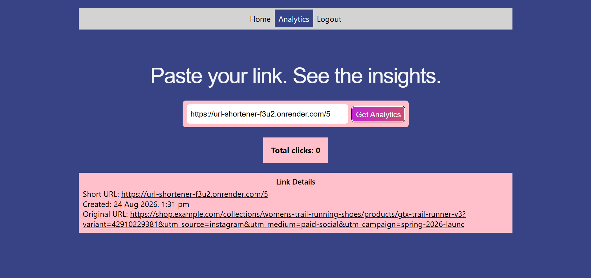

# URL Shortener

A full-stack URL Shortener built using React, FastAPI, and PostgreSQL

## Link
[Try the URL Shortener](https://url-shortener-mayuri9.vercel.app/login)
> Note: The backend is hosted on Render and may take upto a minute
> to wake up after a period of inactivity.

## Demo

### 1. Authentication

### 2. Create a short URL

### 3. View analytics

## Tech Stack

**Frontend:** React, React Router, JavaScript, CSS

**Backend:** Python, FastAPI

**Database:** PostgreSQL

**Authentication:** bcrypt, JWT

**Testing**: pytest, Vitest

**CI/CD:** GitHub Actions

**Deployment:** Vercel, Render

## Features
- User registration and login
- User specific URL ownership and authorization
- JWT-based authentication
- Generate unique short URLs using Base62-encoded auto-increment IDs
- Store URL mappings in PostgreSQL
- Redirect using FastAPI `RedirectResponse`
- View URL analytics
